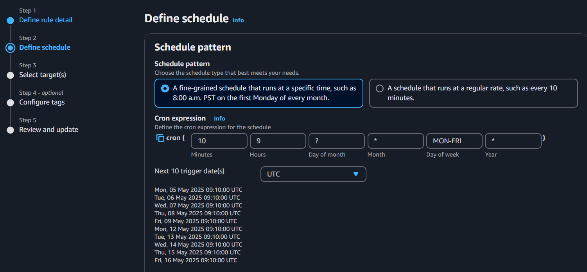
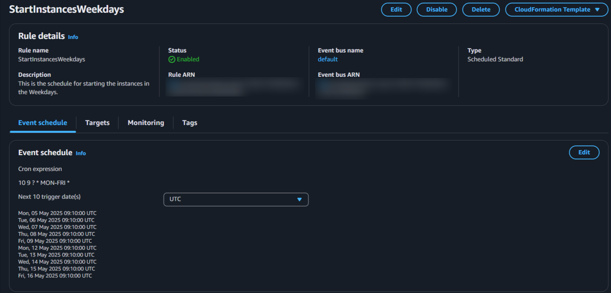
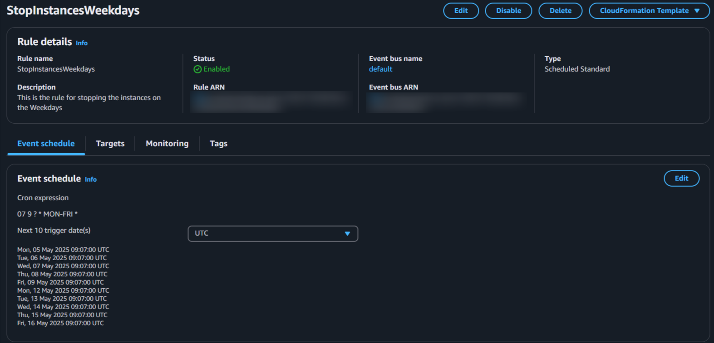

# 🐳 Dockerized Node.js + MongoDB App with GitHub Actions Deployment

This project is a simple Node.js app that connects to MongoDB and is fully Dockerized. It includes a GitHub Actions workflow that deploys the app to an AWS EC2 instance.

---

## 📁 Project Structure

```
.
├── .github
│   └── workflows
│       └── dev.yaml          # GitHub Actions workflow for CI/CD
├── public
│   ├── index.html            # Static HTML file served by Express
│   └── style.css             # CSS file linked from index.html
├── app.js                    # Main Express application
├── Dockerfile                # Docker configuration for the app
├── docker-compose.yml        # Compose file for multi-container setup
├── package.json              # Node.js metadata and dependencies
├── package-lock.json         # Exact dependency versions
├── README.md                 # Project documentation

```

---

## 🧑‍💻 Run Locally

### Prerequisites

- Docker
    
- Docker Compose
    

### Steps

```bash
git clone <repo-url>
cd <repo-directory>
docker-compose up --build
```

- App runs on: `http://localhost:3000` or `http://IP:3000`
    
- MongoDB runs on: `mongodb://localhost:27017` or `http://IP:27017`
    

---

## 🛠️ Files Overview

### `Dockerfile`

```Dockerfile
# Stage 1: Builder
FROM node:16 AS builder

# Set a working directory
WORKDIR /app

# Copy package.json and package-lock.json
COPY package*.json ./

# Install dependencies
RUN npm install

# Copy the rest of the application code
COPY . .

# Build the application
RUN npm run build

# Stage 2: Development
# This is used primarily during development. It can be invoked by building with --target development
FROM node:16 AS development

# Set working directory
WORKDIR /app

# Copy over from builder all files including node_modules and built assets
COPY --from=builder /app ./

# Set the NODE_ENV environment variable to 'development'
ENV NODE_ENV=development

# Expose port 3000 for the development server
EXPOSE 3000

# Run the development server
CMD ["npm", "run", "dev"]

# Stage 2: Production
FROM node:16-alpine AS production

ENV NODE_ENV=production

WORKDIR /app

# Copy essential files from builder stage
COPY --from=builder /app ./

EXPOSE 3000

RUN addgroup -S appgroup && adduser -S appuser -G appgroup
USER appuser

CMD ["npm", "start"]
```

### `docker-compose.yml`

```yaml
version: '3.8'
services:
  app:
    build:
      context: .
      target: development
    volumes:
      - .:/app
      - /app/node_modules
    ports:
      - "3000:3000"
    environment:
      - NODE_ENV=development
    depends_on:
      - mongo
  mongo:
    image: mongo:latest
    ports:
      - "27017:27017"
    volumes:
      - mongodb_data:/data/db
volumes:
  mongodb_data:
```

---

## 🚀 Deployment

### Prerequisites

- AWS EC2 instance (Ubuntu recommended)
    
- Docker + Docker Compose installed on EC2
    
- SSH key pair to connect
    

### Deployment Steps

1. Add EC2 IP and key to GitHub Secrets:
    
- `DEV_EC2_HOST`: Your DEV EC2 instance’s public IP or DNS
    
- `EC2_SSH_KEY`: Your private key to connect to the EC2 instance (in PEM format)
    
- `EC2_USER`: EC2 Host name e.g: ubuntu
    
        
1. GitHub Action will:
    
    - Build the Docker image
        
    - Copy files to EC2
        
    - Rebuild and restart containers on the server
        

---

## 📦 GitHub Actions – CI/CD Workflow

This project uses a GitHub Actions workflow to automate building and deploying the Dockerized Node.js + MongoDB application to an AWS EC2 instance.

### Workflow File: `.github/workflows/dev.yaml`

```yaml
name: Deploy to Development EC2

on:
  push:
    branches:
      - dev
  workflow_dispatch:

jobs:
  build-and-deploy:
    name: Build and Deploy Dev
    runs-on: ubuntu-latest

    steps:
      - name: Checkout source
        uses: actions/checkout@v4

      - name: Set up Docker Buildx
        uses: docker/setup-buildx-action@v3

      - name: Build Dev Docker Compose
        run: docker compose -f docker-compose.dev.yml build

      - name: SSH into EC2 and Deploy
        run: |
          echo "${{ secrets.EC2_SSH_KEY }}" > private_key.pem
          chmod 600 private_key.pem
          ssh -o StrictHostKeyChecking=no -i private_key.pem ${{ secrets.EC2_USER }}@${{ secrets.DEV_EC2_HOST }} << 'EOF'
            sudo ls -la
            sudo rm -rf Docker-multi-stage
            sudo git clone --branch dev https://github.com/fzmubin98/Docker-multi-stage.git
            cd Docker-multi-stage
            sudo docker compose -f docker-compose.dev.yml down
            sudo docker image prune -y
            sudo docker compose -f docker-compose.dev.yml up --build -d
          EOF
```

### Workflow File: `.github/workflows/prod.yaml`
```yaml
name: Deploy to Production EC2

on:
  workflow_dispatch:

jobs:
  build-and-deploy:
    name: Build and Deploy Prod
    runs-on: ubuntu-latest

    steps:
    - name: Checkout source
      uses: actions/checkout@v4

    - name: Set up Docker Buildx
      uses: docker/setup-buildx-action@v3

    - name: Build Dev Docker Compose
      run: docker compose -f docker-compose.prod.yml build

    - name: SSH into EC2 and Deploy
      run: |
        echo "${{ secrets.EC2_SSH_KEY }}" > private_key.pem
        chmod 600 private_key.pem
        ssh -o StrictHostKeyChecking=no -i private_key.pem ${{ secrets.EC2_USER }}@${{ secrets.PROD_EC2_HOST }} << 'EOF'
          sudo ls -la
          sudo rm -rf Docker-multi-stage
          sudo git clone https://github.com/fzmubin98/Docker-multi-stage.git
          cd Docker-multi-stage
          sudo docker compose -f docker-compose.prod.yml down
          sudo docker image prune -y
          sudo docker compose -f docker-compose.prod.yml up --build -d
        EOF
```

### 🔐 Secrets Required

Set the following GitHub Secrets:

- `EC2_SSH_KEY`: Your private key to connect to the EC2 instance (in PEM format)
    
- `EC2_USER`: EC2 Host name e.g: ubuntu
    
- `PROD_EC2_HOST`: Your Prod EC2 instance’s public IP or DNS

---

## 🧪 Test App

```bash
curl http://localhost:3000
```


Expected output:

```
It is possible to add, Mark as done and delete elements
```

---

## AWS Lambda

**Start Function**
```python
import boto3

def lambda_handler(event, context):
    ec2 = boto3.client('ec2', region_name='us-east-1')
    instances = ['instance-1', 'Instance-2']  # Add your dev and prod instance IDs
    ec2.start_instances(InstanceIds=instances)
```

**Stop Function**
```python
import boto3

def lambda_handler(event, context):
    ec2 = boto3.client('ec2', region_name='us-east-1')
    instances = ['instance-1', 'instance-2']  # Add your dev and prod instance IDs
    ec2.stop_instances(InstanceIds=instances)
```

## AWS EventBridge
**Scheduling**


**Start Function**


**Stop Function**


## 🧹 Clean Up

```bash
docker-compose down -v
```

---

## 📃 License

MIT